# FireWatch Architecture Diagram

## System Overview

FireWatch is a real-time forest fire detection system that processes video streams using machine learning, stores results in Kafka, and uploads annotated videos to S3.

## High-Level Architecture

```mermaid
flowchart TB
    subgraph Sources["📹 Video Sources"]
        direction LR
        V1[Video Files]
        V2[Camera Streams]
        V3[Uploaded Videos]
    end

    subgraph Kafka["☁️ Kafka Cluster (MSK Serverless/Provisioned)"]
        direction TB
        K1["📨 video-frames<br/>6 Partitions"]
        K2["🔥 fire-detections<br/>6 Partitions"]
        K3["✅ video-completions<br/>3 Partitions"]
    end

    subgraph Processing["⚙️ Processing Layer"]
        direction TB
        P["🎬 Video Producer<br/>Extracts Frames"]
        S["🤖 Fire Detection Stream<br/>ML Inference + Heatmap Overlay"]
        C["📤 S3 Upload Consumer<br/>Uploads Annotated Videos"]
    end

    subgraph Storage["💾 Storage"]
        S3[("🪣 S3 Bucket<br/>Annotated Videos")]
    end

    %% Video Sources to Producer
    V1 --> P
    V2 --> P
    V3 --> P

    %% Producer to Kafka
    P -->|"Frames<br/>(Base64)"| K1

    %% Kafka to Stream Processor
    K1 -->|"Frames"| S

    %% Stream Processor to Kafka
    S -->|"Detections<br/>(JSON)"| K2
    S -->|"Completion Events"| K3

    %% Kafka to Consumer
    K3 -->|"Events"| C

    %% Consumer to Storage
    C -->|"Annotated Videos<br/>(MP4)"| S3

    %% Styling
    classDef kafkaTopic fill:#e1f5ff,stroke:#01579b,stroke-width:2px,color:#000
    classDef processor fill:#fff3e0,stroke:#e65100,stroke-width:2px,color:#000
    classDef storage fill:#e8f5e9,stroke:#2e7d32,stroke-width:2px,color:#000
    classDef source fill:#f3e5f5,stroke:#4a148c,stroke-width:2px,color:#000

    class K1,K2,K3 kafkaTopic
    class P,S,C processor
    class S3 storage
    class V1,V2,V3 source
```



## Detailed Component Architecture

```mermaid
flowchart LR
    subgraph Producer["🎬 Video Producer"]
        direction TB
        VP[Video Producer]
        FE[Frame Extractor<br/>OpenCV]
        EN[Base64 Encoder]
        VP --> FE
        FE --> EN
    end

    subgraph Stream["🤖 Fire Detection Stream"]
        direction TB
        FD[Fire Detection Stream]
        ML["🧠 ML Model<br/>fire-detect-nn<br/>DenseNet121"]
        HM["🔥 GradCAM Heatmap<br/>Visual Fire Regions"]
        VO[Video Overlay<br/>Heatmap + Original]
        FD --> ML
        ML --> HM
        HM --> VO
    end

    subgraph Consumer["📤 S3 Upload Consumer"]
        direction TB
        S3C[S3 Upload Consumer]
        UP[S3 Uploader<br/>Boto3]
        S3C --> UP
    end

    subgraph Storage["💾 Storage"]
        S3[("🪣 S3 Bucket")]
    end

    EN -->|"Frames<br/>(Base64)"| FD
    VO -->|"Completion Events<br/>(JSON)"| S3C
    UP -->|"Annotated Videos<br/>(MP4)"| S3

    %% Styling
    classDef mlModel fill:#ffebee,stroke:#c62828,stroke-width:3px,color:#000
    classDef heatmap fill:#fff3e0,stroke:#e65100,stroke-width:2px,color:#000
    classDef component fill:#e3f2fd,stroke:#1565c0,stroke-width:2px,color:#000
    classDef storage fill:#e8f5e9,stroke:#2e7d32,stroke-width:2px,color:#000

    class ML mlModel
    class HM heatmap
    class VP,FE,EN,FD,VO,S3C,UP component
    class S3 storage
```



## AWS Deployment Architecture

```mermaid
graph TB
    subgraph "AWS VPC"
        subgraph "Public Subnets"
            NAT[NAT Gateway<br/>1x (Default)<br/>Configurable]
        end

        subgraph "Private Subnets"
            subgraph "ECS Cluster"
                FDS[Fire Detection Stream<br/>2-10 Tasks<br/>4GB/2CPU]
                S3U[S3 Upload Consumer<br/>1-5 Tasks<br/>2GB/1CPU]
            end
        end

        subgraph "Isolated Subnets"
            MSK["MSK Cluster<br/>Serverless (Default)<br/>or Provisioned<br/>3 Brokers"]
        end
    end

    subgraph "Storage"
        S3[(S3 Bucket<br/>Encrypted KMS<br/>Lifecycle Policies)]
        ECR[ECR Repositories<br/>3x Services]
    end

    subgraph "Monitoring"
        CW[CloudWatch Logs<br/>Container Insights]
    end

    FDS -->|Consume| MSK
    FDS -->|Publish| MSK
    S3U -->|Consume| MSK
    S3U -->|Upload| S3
    FDS -->|Logs| CW
    S3U -->|Logs| CW
    ECR -->|Images| FDS
    ECR -->|Images| S3U
    NAT -->|Internet| FDS
    NAT -->|Internet| S3U

    style MSK fill:#f9f,stroke:#333,stroke-width:3px
    style S3 fill:#bfb,stroke:#333,stroke-width:3px
    style FDS fill:#bbf,stroke:#333,stroke-width:2px
    style S3U fill:#fbf,stroke:#333,stroke-width:2px
```

## Data Flow


## Scaling Architecture


## Technology Stack


## Component Details

### Video Producer
- **Input**: Video files (MP4, AVI, etc.)
- **Output**: Base64-encoded frames to Kafka
- **Key Features**:
  - Frame extraction with configurable interval
  - Frame resizing (640x480 default)
  - Partitioning by `video_id` (ensures order)

### Fire Detection Stream
- **Input**: Frames from `video-frames` topic
- **Output**: 
  - Detection results to `fire-detections` topic
  - Completion events to `video-completions` topic
  - Local annotated video files
- **Key Features**:
  - ML inference (fire-detect-nn DenseNet121)
  - GradCAM heatmap generation
  - Real-time video overlay
  - Incremental video writing (prevents OOM)

### S3 Upload Consumer
- **Input**: Completion events from `video-completions` topic
- **Output**: Videos uploaded to S3
- **Key Features**:
  - Parallel upload processing
  - Automatic local file cleanup
  - Error handling and retry logic

## Performance Characteristics

### Throughput
- **Per Consumer**: 20-30 frames/second
- **With 6 Partitions**: 120-180 frames/second total
- **Scalability**: Linear scaling with partition count

### Latency
- **Frame Processing**: < 1 second (ML inference + overlay)
- **Video Upload**: Depends on video size and network
- **End-to-End**: < 2 seconds per frame (typical)

### Resource Requirements
- **Fire Detection Stream**: 4GB RAM, 2 CPU per task
- **S3 Upload Consumer**: 2GB RAM, 1 CPU per task
- **MSK Broker**: 4GB RAM, 2 vCPU (m5.large)

## Security Architecture


## Deployment Environments

### Local Development
```
Docker Compose → Kafka (Local)
     ↓
Python Scripts → Process Videos
     ↓
Local Storage → clips/ directory
```

### AWS Production
```
MSK Cluster → Kafka (Managed)
     ↓
ECS Fargate → Containerized Services
     ↓
S3 Bucket → Cloud Storage
```

## Monitoring & Observability


## Cost Breakdown (Estimated)

### Active Usage Costs

| Component | Monthly Cost (us-east-1) | Pay-as-You-Go? |
|-----------|-------------------------|-----------------|
| **MSK Serverless (Default)** | ~$0-60 | ✅ Pay per GB (varies with usage) |
| **MSK Provisioned** | ~$450 | ⚠️ Charges when idle |
| ECS Fargate (2 tasks, Spot) | ~$45-75 | ✅ Can scale to 0 |
| S3 Storage (100GB) | ~$2.30 | ✅ Pay per GB |
| S3 Requests | ~$1 | ✅ Pay per request |
| NAT Gateway (1x) | ~$32 | ⚠️ Charges when idle |
| VPC Endpoint (S3) | ~$7 | ⚠️ Charges when idle |
| CloudWatch | ~$5-10 | ✅ Pay per GB |
| **Total (Active, Serverless)** | **~$90-190/month** | |
| **Total (Idle, Serverless)** | **~$39/month** | Fixed costs only |
| **Total (Active, Provisioned)** | **~$540-580/month** | |
| **Total (Idle, Provisioned)** | **~$489/month** | Fixed costs only |

### ⚠️ Important Cost Notes

- **MSK Serverless (Default)**: Pay only for data ingested/stored - ~$0 when idle
- **MSK Provisioned**: Cannot scale to 0 (Kafka requires running brokers) - ~$450/month minimum
- **NAT Gateway**: Charges per hour even when idle - ~$32/month minimum
- **ECS Fargate**: Can scale to 0 tasks - $0 when idle
- **S3**: Pay only for storage and requests - $0 when empty

**To minimize idle costs:**
- ✅ Use MSK Serverless (default) - eliminates ~$450/month idle cost
- Scale ECS tasks to 0 when not processing
- Use VPC endpoints to reduce NAT gateway usage
- Consider deleting stack when not in use

**At Scale (24/7, 1+ year):**
- AWS Savings Plans: Up to 66% savings on compute
- MSK Provisioned Reserved Capacity: Up to 30% savings (only if using Provisioned)
- See [infrastructure/docs/COST_OPTIMIZATION.md](../infrastructure/docs/COST_OPTIMIZATION.md) for detailed MSK trade-offs

## Key Design Decisions

1. **Kafka for Streaming**: Enables horizontal scaling and fault tolerance
2. **Partitioning by video_id**: Ensures frames from same video processed in order
3. **Separate S3 Consumer**: Decouples ML processing from storage operations
4. **Incremental Video Writing**: Prevents OOM errors for long videos
5. **GradCAM Heatmaps**: Provides visual explanation of ML predictions
6. **ECS Fargate**: Serverless containers, no infrastructure management
7. **MSK Managed Kafka**: Reduces operational overhead

## Future Enhancements

- [ ] Real-time alerting (SNS/SES integration)
- [ ] Dashboard for monitoring (CloudWatch Dashboards)
- [ ] Multi-region deployment
- [ ] GPU support for faster ML inference
- [ ] Video streaming API (API Gateway + Lambda)
- [ ] Analytics pipeline (Kinesis → Redshift)

